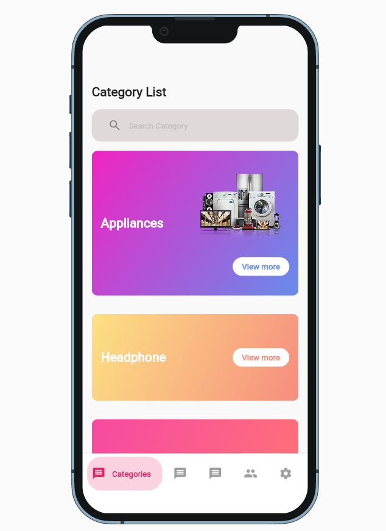

# Flutter Manager App
Contributors:
<ol>
	<li>Võ Xuân An</li>
	<li>Trần Văn Duy</li>
	<li>Trương Thụy Quang Nhật</li>
</ol>

# To run this app
Type the command and hit enter:
```
flutter run --no-sound-null-safety
```

# Preview Images





